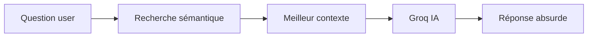

# 🤪 Chat-Bruti API

Le chatbot le plus absurde du web ! Chat-Bruti utilise la recherche sémantique pour trouver du contexte pertinent... puis le détourne complètement pour donner des réponses hilarantes et inutiles.

## 🎯 Fonctionnalités

- **Scraping automatique** du site NIRD au démarrage
- **Recherche sémantique** intelligente avec similarité cosinus
- **Génération IA** de réponses absurdes via Groq (Llama 3.3)
- **API REST complète** avec FastAPI
- **Persistance des données** en JSON

## 📁 Structure du projet

```
chat-bruti/
├── app/
│   ├── __init__.py
│   ├── config.py              # Configuration centralisée
│   ├── main.py                # API principale
│   ├── modules/
│   │   ├── __init__.py
│   │   ├── scraper.py         # Scraping & chunking
│   │   ├── semantic_search.py # Recherche sémantique
│   │   └── chat_generator.py  # Génération Groq
│   └── data/
│       └── nird_chunks.json   # Données scrapées
├── requirements.txt
├── .env                       # Variables d'environnement
└── README.md
```

## 🚀 Installation

### 1. Cloner et installer les dépendances

```bash
# Créer un environnement virtuel
python -m venv venv
source venv/bin/activate  # Linux/Mac
# ou
venv\Scripts\activate     # Windows

# Installer les dépendances
pip install -r requirements.txt
```

### 2. Configuration

Créez un fichier `.env` à la racine :

```bash
cp .env.example .env
```

Éditez `.env` et ajoutez votre clé API Groq :

```env
GROQ_API_KEY=gsk_votre_cle_ici
```

> 🔑 Obtenez une clé gratuite sur [console.groq.com](https://console.groq.com/keys)

### 3. Lancer l'API

```bash
# Méthode 1: Avec uvicorn directement
uvicorn app.main:app --reload --host 0.0.0.0 --port 8000

# Méthode 2: Avec Python
python -m app.main
```

L'API sera disponible sur : **http://localhost:8000**

## 📡 Endpoints

### 🏠 Page d'accueil
```bash
GET /
```

### 💬 Chat principal (tout-en-un)
```bash
POST /chat
Content-Type: application/json

{
  "question": "C'est quoi NIRD ?"
}
```

**Réponse :**
```json
{
  "question": "C'est quoi NIRD ?",
  "response": "Yeahh ! NIRD c'est comme Netflix mais pour les ordinateurs qui veulent devenir végans...",
  "context": "La démarche NIRD promeut un numérique Inclusif...",
  "confidence": 0.742,
  "source_url": "https://nird.forge.apps.education.fr/",
  "source_title": "Accueil NIRD",
  "timestamp": "2025-01-05T14:30:00"
}
```

### 🔄 Forcer un scraping
```bash
POST /scrape
```

### 🔍 Recherche sémantique seule (debug)
```bash
POST /search
Content-Type: application/json

{
  "question": "reconditionnement"
}
```

### 📊 Statistiques
```bash
GET /stats
```

### ❤️ Health check
```bash
GET /health
```

### 📚 Documentation interactive
```bash
GET /docs
```

## ⚙️ Configuration

Tous les paramètres sont dans `app/config.py` :

| Paramètre | Défaut | Description |
|-----------|--------|-------------|
| `NIRD_URL` | `https://nird.forge.apps.education.fr/` | URL à scraper |
| `CHUNK_SIZE` | `1000` | Taille des chunks (caractères) |
| `CHUNK_OVERLAP` | `200` | Chevauchement entre chunks |
| `SIMILARITY_THRESHOLD` | `0.12` | Seuil de similarité min |
| `MAX_CONTEXT_LENGTH` | `600` | Longueur max du contexte |
| `GROQ_MODEL` | `llama-3.3-70b-versatile` | Modèle Groq |
| `CHAT_TEMPERATURE` | `1.5` | Créativité (0-2) |
| `AUTO_SCRAPE_ON_STARTUP` | `True` | Scraping au démarrage |

## 🧪 Test rapide

```bash
# Test avec curl
curl -X POST "http://localhost:8000/chat" \
  -H "Content-Type: application/json" \
  -d '{"question": "Comment installer Linux ?"}'

# Test avec httpie (plus joli)
http POST localhost:8000/chat question="C'est quoi le libre ?"
```

## 🐛 Dépannage

### Erreur "GROQ_API_KEY est requis"
➡️ Vérifiez que votre `.env` contient une clé valide

### Erreur "Service de recherche non disponible"
➡️ Lancez d'abord `/scrape` ou vérifiez que `AUTO_SCRAPE_ON_STARTUP=True`

### Pas de données au démarrage
➡️ Vérifiez que l'URL NIRD est accessible et que le scraping fonctionne

### Scraping échoue
➡️ Vérifiez votre connexion internet et les logs

## 📝 Workflow complet



1. **Au démarrage** : Scraping automatique → Indexation
2. **À chaque question** :
   - Recherche du meilleur contexte (cosine similarity)
   - Génération d'une réponse absurde via Groq
   - Retour JSON complet

## 🤝 Contribution

Ce projet est fait pour la Nuit de l'Info 2025 ! N'hésitez pas à :
- Ajouter de nouvelles sources à scraper
- Améliorer les prompts Chat-Bruti
- Optimiser la recherche sémantique
- Ajouter du cache

## 📄 Licence

MIT - Faites-en ce que vous voulez ! 🎉

---

**Fait avec ❤️ (et beaucoup de café) pour la Nuit de l'Info 2025**